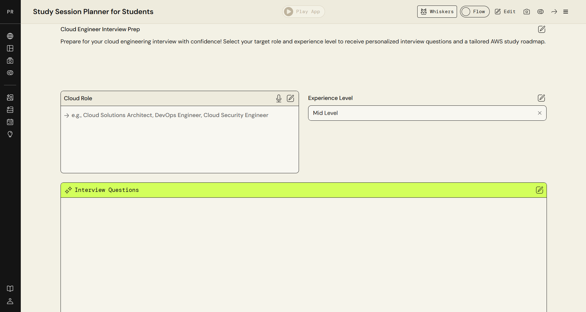
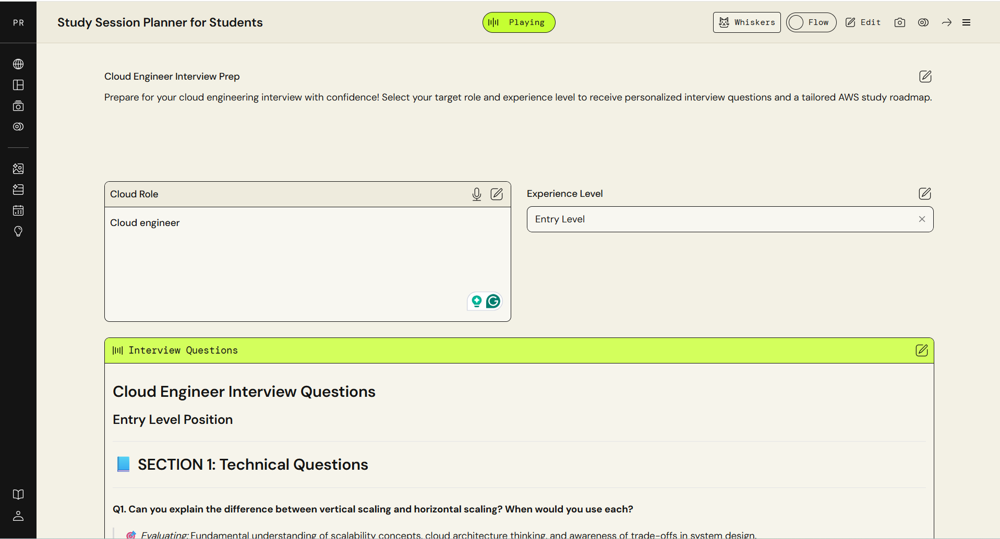
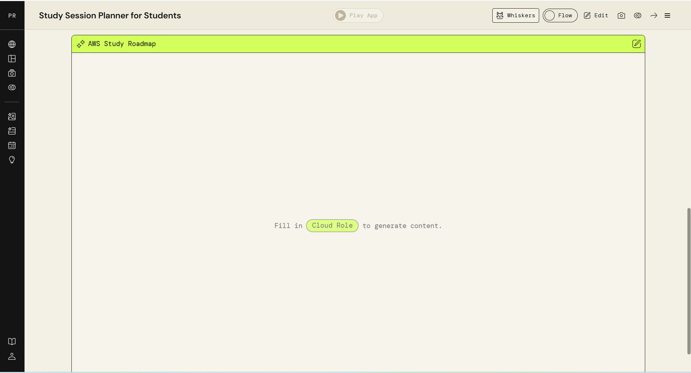
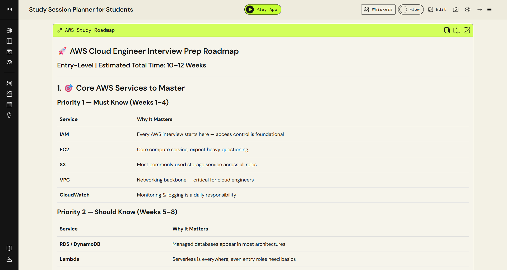

# Study Session Planner for Students

An AI-powered study companion built on AWS PartyRock. It generates personalised interview questions and study roadmaps for cloud roles.

 **[Try it free here](https://partyrock.aws/u/Blessing07/REyeNsepn/Study-Session-Planner-for-Students)**

---

##  Overview

The Study Session Planner is a no-code AI app built using AWS PartyRock. It is designed for students preparing for cloud certifications and entry-level cloud roles.

You enter your target cloud role and experience level, and the app generates two outputs instantly:

- **Personalised interview questions** tailored to your role and level
- **A structured AWS study roadmap** with prioritised services and a weekly timeline

---

##  Features

| Feature | Description |
|---|---|
|  Interview Questions | Role-specific questions organised by section (Technical, Behavioural, Scenario-based) |
|  AWS Study Roadmap | Priority-based weekly plan covering must-know and should-know AWS services |
|  Instant Generation | Results generated in seconds based on your inputs |
|  Free to Use | No account required, open to anyone |

---

##  Screenshots

### Input Screen
> Enter your Cloud Role and Experience Level to get started.

### Interview Questions Output
> The app generates structured, role-specific interview questions instantly.

### Study Roadmap Prompt
> The AWS Study Roadmap widget ready for your input.

### Study Roadmap Output
> A prioritised weekly roadmap with services ranked by importance.

---

##  How I Built It

**Platform:** AWS PartyRock (powered by Amazon Bedrock)

**Approach:** No-code, built entirely using PartyRock's widget-based interface and prompt engineering.

**Steps:**

1. **Identified the problem** — Studying for cloud roles without structure is overwhelming. I needed a tool that gives direction fast.
2. **Designed the inputs** — Two simple inputs: Cloud Role and Experience Level. Keeps the barrier to entry low.
3. **Engineered the prompts** — Wrote detailed prompts for each widget to ensure outputs were specific, structured, and useful rather than generic.
4. **Built two output widgets** — Interview Questions and AWS Study Roadmap as separate widgets so users get both types of prep in one session.
5. **Tested and iterated** — Ran the app against multiple roles (Cloud Engineer, DevOps Engineer, Solutions Architect) and refined prompts based on output quality.

**Key lesson:** Prompt engineering is a skill. The quality of the output is directly tied to how clearly you define the task, the format, and the context inside the prompt.

---

##  Tools Used

- AWS PartyRock
- Amazon Bedrock
- Prompt Engineering

